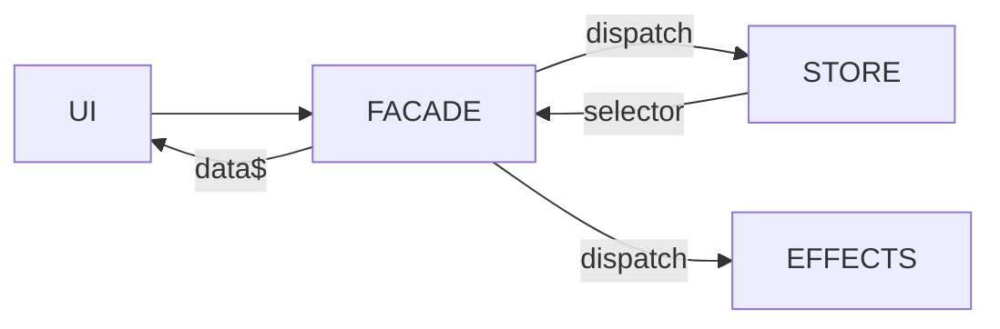

We are all tired of the debate around unit testing vs integration testing; both have their place. But I'm here to tell you that unit testing your NgRx store is not worth it.😱

**NOTE:** This post is going to assume that you have familiarity with all the moving parts of NgRx.

Let's start with the humble todo app. Instead of just an in-memory todo app, let's spice it up with a REST API that we hit on every interaction.

## The NgRx Parts

We could model our state like this:

```typescript
export type Todo = {
  id: string;
  text: string;
  completed: boolean;
};
interface TodoState {
  todos:  data: Todo[] >;
  status: 'loading' | 'loaded' | 'error';
}
```

Given the state above, your actions may look something like this:

```typescript
export const TodoUIActions = createActionGroup({
  source: 'Todo UI',
  events: {
    'Load Todos': () => emptyProps(),
    'Load Todos Success': props<{ todos: Todo[] }>(),
    'Mark Todo Complete': props<{ id: string }>(),
    'Mark Todo Incomplete': props<{ id: string }>(),
    'Mark Todo Complete Success': props<{ id: string }>(),
    'Mark Todo Complete Failure': props<{ id: string }>(),
    'Mark Todo Incomplete Success': props<{ id: string }>(),
    'Mark Todo Incomplete Failure': props<{ id: string }>(),
  },
});
```

Nothing exciting here. Just the standard grouping of trigger,success,failure actions that can happen in some async effect.

## Unit Testing

Being a good dev means writing tests. So of course NgRx has made each part of the framework super unit testable. Even though the framework is setup for testing each individual part. I find that this is mostly a waste of time. You end up doing enough mocking of the input/output of each part of NgRx (reducer, effect, selectors) that you end up not testing anything besides your mocks.

A quick look at what a standard unit test of an effect would look like. Here is the effect to load the todos

```typescript
const loadTodos$ = createEffect(
  (actions$ = inject(Actions), todoService = inject(TodoService)) => {
    return actions$.pipe(
      ofType(TodoUIActions.loadTodos),
      mergeMap(() =>
        todoService.loadTodos().pipe(
          map((todos) => TodoUIActions.loadTodosSuccess({ todos })),
          catchError(() => of(TodoUIActions.loadTodosFailure()))
        )
      )
    );
  },
  { functional: true }
);
```

This is basically the most straight-forward type of effect you will write in a CRUD app. Listen to the trigger, make the HTTP request through the service, return success (or failure) action. Looking at the NgRx documentation, this is what a unit test would look like

```typescript
it('should test something useful', () => {
  actions$ = hot('a|', { a: { type: TodoUIActions.loadTodos.type } });
  const todoService: Partial<TodoService> = {
    loadTodos: () =>
      cold('b|', { b: [{ id: '1', text: 'Todo 1', completed: false }] }),
  };

  const expected = hot('b|', {
    b: {
      type: TodoUIActions.loadTodosSuccess.type,
      todos: [{ id: '1', text: 'Todo 1', completed: false }],
    },
  });

  expect(
    todoEffects.loadTodos$(actions$, todoService as TodoService)
  ).toBeObservable(expected);
});
```

Seems solid enough right? But look closer. What are we really testing here? You are mocking the action being called, the service call, and expecting that the data you hand rolled is the same data on the other side. It's a lot of typing and mocking and assembling data that does effectively nothing of value for the code quality.

Sure, you could argue you could have some business logic in here that would be exercised in some way. But most effects, in my experience, can (and should) be pretty simplistic. And in reality when they do get more complicated, they are usually assembling some data from other observables. All which would have to be painfully mocked, all to test that you mocked the inputs correctly.

**The beauty of NgRx really only realized when all the parts work in concert with each other**. To get the full picture, you would essentially have to unit test each piece of NgRx in isolation. Mocking the output of one unit test to then re-mock that as input for another part. When you split up each part to test individually, you lose the cohesive responsive system that makes NgRx so wonderful to begin with.

If you take the time to setup an integration test, you not only test all the pieces of NgRx in unison, because NgRx handles so much of your logic, you actually get near e2e test coverage without the cost of spinning up some browser automation.

## The Facade

The facade approach is not a new one, but I think one that is not utilized enough. Normally, you may inject the store into some container or route-level component to take care of dispatching and selecting data from the NgRx store. If you just take one step more and put all of these store interactions inside of of a "facade" service, you have created a consistent and NgRx agnostic front door API to your application state.



Our `TodoFacade` would look like this:

```typescript
@Injectable({ providedIn: 'root' })
export class TodoFacade {
  #store = inject(Store);
  todoState$ = this.#store.select(selectTodoState);
  loadTodos() {
    this.#store.dispatch(TodoUIActions.loadTodos());
  }

  markTodoAsCompleted(id: string) {
    this.#store.dispatch(TodoUIActions.markTodoComplete({ id }));
  }

  markTodoAsIncomplete(id: string) {
    this.#store.dispatch(TodoUIActions.markTodoIncomplete({ id }));
  }
}
```

As we will see, not only does this create a public API to the store, it gives us the entryway into our integration tests.

## The Facade Test

As mentioned before, this is just an integration test but leverages the facade as the API to be exercised. Here is the full code for the setup and a single spec.

```typescript
describe('TodoFacade', () => {
  let httpController: HttpTestingController;
  let facade: TodoFacade;
  beforeEach(() => {
    // Provides the entire store to the testing modules
    TestBed.configureTestingModule({
      imports: [HttpClientTestingModule],
      providers: [
        TodoFacade,
        provideStore(),
        provideState(todoFeature),
        provideEffects(todoEffects),
      ],
    });
    httpController = TestBed.inject(HttpTestingController);
    facade = TestBed.inject(TodoFacade);
  });

  afterEach(() => {
    // Verifies any unmatched HTTP calls will cause your tests to fail.
    // This makes sure all HTTP calls are accounted for
    httpController.verify();
  });

  it('should get get the todos from the API', async () => {
    // Kick off the action in the same way your component would
    facade.loadTodos();

    // Ge the state out of the store without dealing with subscriptions and callbacks
    let todoState = await firstValueFrom(facade.todoState$);

    // This verifies that immediately after firing our action,
    // the reducer correctly updated the status to "loading"
    expect(todoState.status).toEqual('loading');

    // Now we can test that our action got all the way to making a real HTTP call to the expected endpoint
    // we can flush real HTTP status codes
    httpController
      .expectOne('/api/todos')
      .flush([{ id: '1', text: 'Todo 1', completed: false }]);

    todoState = await firstValueFrom(facade.todoState$);

    // Verifies that after our effect finishes, the reducer picks up the
    // "success" action and updates the state. Provides the type narrowing below
    expect(todoState.status).toEqual('loaded');

    // Use Jest snapshots to better capture the expected structure of your state
    expect(todoState.todos).toMatchSnapshot();
  });
});
```

There is a little setup to be sure, but the result is that you are exercising the _entire_ store in any given test. This one test is testing the complete expectation that a component would have; kicking off an action to get data, and then expecting that data to come back through as an observable to the template. Any special business logic, or view model assembly inside of the selector would all be run, and the output would be something that the consumer (the component) would actually care about. Not only that, but the test reads like a book. No obscure ASCII marble diagrams or subscriptions to manage.

Let's do a couple more specs that test a bit more of a todo list set of interactions:

```typescript
it('should mark the todo as completed via the API', async () => {
  // load the todos like above
  facade.loadTodos();

  // flush the response from the API with a single todo that is not yet completed
  httpController
    .expectOne('/api/todos')
    .flush([{ id: '1', text: 'Todo 1', completed: false }]);

  // use the facade to mark the todo as completed
  facade.markTodoAsCompleted('1');

  // Make sure that our store was eagerly updated, even before the API call finished
  const todoState = await firstValueFrom(facade.todoState$);
  expect(todoState.todos[0].completed).toEqual(true);

  // verify that the HTTP call was made to the correct endpoint
  httpController.expectOne('/api/todos/1').flush(201);
});

// Same as the previous spec, but in reverse
it('should mark the todo as completed via the API', async () => {
  // load the todos like above
  facade.loadTodos();

  // flush the response from the API with a single todo that is not yet completed
  httpController
    .expectOne('/api/todos')
    .flush([{ id: '1', text: 'Todo 1', completed: true }]);

  // use the facade to mark the todo as incomplete
  facade.markTodoAsCompleted('1');

  // Make sure that our store was eagerly updated, even before the API call finished
  const todoState = await firstValueFrom(facade.todoState$);
  expect(todoState.todos[0].completed).toEqual(false);

  // verify that the HTTP call was made to the correct endpoint
  httpController.expectOne('/api/todos/1').flush(201);
});
```

Alright, what about something a bit more complicated. Our logic does an optimistic update to the store when a user checks the todo off. What happens if our API fails? Can we test rolling back that update to the store? Absolutely! And actually the test is almost the exact same

```typescript
it('should uncheck the todo if the API call fails', async () => {
  facade.loadTodos();
  // flush the response from the API with a single todo that is not yet completed
  httpController
    .expectOne('/api/todos')
    .flush([{ id: '1', text: 'Todo 1', completed: false }]);

  // use the facade to mark the todo as completed
  facade.markTodoAsCompleted('1');

  // Make sure that our store was eagerly updated, even before the API call finished
  let todoState = await firstValueFrom(facade.todoState$);

  expect(todoState.todos[0].completed).toEqual(true);

  //  flush an error instead of a success
  httpController
    .expectOne('/api/todos/1')
    .flush(null, { status: 500, statusText: 'Internal Server Error' });

  // Make sure the todo was set back to unchecked
  todoState = await firstValueFrom(facade.todoState$);
  expect(todoState.todos[0].completed).toEqual(false);
});
```

Alright one last one. What if you want to test that your HTTP call reties 3 times before failing?

```typescript
it('should uncheck the todo if the API call fails after 3 attempts', async () => {
  facade.loadTodos();
  // flush the response from the API with a single todo that is not yet completed
  httpController
    .expectOne('/api/todos')
    .flush([{ id: '1', text: 'Todo 1', completed: false }]);

  // use the facade to mark the todo as completed
  facade.markTodoAsCompleted('1');

  // Make sure that our store was eagerly updated, even before the API call finished
  let todoState = await firstValueFrom(facade.todoState$);

  expect(todoState.todos[0].completed).toEqual(true);

  //  flush an error instead of a success 3 times as we expect the HTTP call to be retried 3 times
  httpController
    .expectOne('/api/todos/1')
    .flush(null, { status: 500, statusText: 'Internal Server Error' });
  httpController
    .expectOne('/api/todos/1')
    .flush(null, { status: 500, statusText: 'Internal Server Error' });
  httpController
    .expectOne('/api/todos/1')
    .flush(null, { status: 500, statusText: 'Internal Server Error' });
  httpController
    .expectOne('/api/todos/1')
    .flush(null, { status: 500, statusText: 'Internal Server Error' });

  // Make sure the todo was set back to unchecked
  todoState = await firstValueFrom(facade.todoState$);

  expect(todoState.todos[0].completed).toEqual(false);
});
```

As mentioned in the specs above, the beauty of the facade pattern is that you now are testing the same pathway that your component will use. And because NgRx takes care of all your business logic, you are left with a near empty component.

```typescript
@Component({
  selector: 'justinrassier-dot-com-todo-feature',
  standalone: true,
  imports: [NgIf, NgFor, AsyncPipe, NgClass],
  changeDetection: ChangeDetectionStrategy.OnPush,
  template: `
    <ng-container *ngIf="todoFacade.todoState$ | async as todoState">
      <div class="p-4 ">
        <h1>Todos</h1>
        <div *ngIf="todoState.status === 'loading'">Loading...</div>
        <ul *ngIf="todoState.status === 'loaded'">
          <li *ngFor="let todo of todoState.todos">
            <div class="flex gap-2">
              <input
                type="checkbox"
                [checked]="todo.completed"
                (change)="onChange($event, todo.id)"
              />
              <span
                [ngClass]="{
                  'line-through': todo.completed,
                  'no-underline': !todo.completed
                }"
                >{{ todo.text }}</span
              >
            </div>
          </li>
        </ul>
      </div>
    </ng-container>
  `,
})
export class TodoFeatureComponent {
  todoFacade = inject(TodoFacade);

  constructor() {
    this.todoFacade.loadTodos();
  }

  onChange(event: Event, id: string) {
    const target = event.target as HTMLInputElement;
    if (target.checked) {
      this.todoFacade.markTodoAsCompleted(id);
    } else {
      this.todoFacade.markTodoAsIncomplete(id);
    }
  }
}
```

There is almost nothing here. I would argue that that it is mostly a waste of time to spend any time trying to test this component. I mean, all you are really doing at that point is testing that Angular can handle rendering a template. I'm pretty sure Angular doesn't need my test to verify that. Because of this, you end up with something that can approach e2e level of coverage and confidence without ever spinning up a headless browser.

Of course a todo app isn't very complicated. But this pattern scales surprisingly well. NgRx is an amazing library that manages the complexity of business logic and state management. When things do get more complicated, utilizing the [Component Store](https://ngrx.io/guide/component-store) and a similar integration test approach can once again keep your from filling up your component with messy code.

## Summary

NgRx is an amazing library. Many people complain about all the moving parts, but each moving part has a purpose. When all the pieces are working together, you get something that scales to manage complexity better than anything I've used before. But testing each individual piece in isolation means you lose the benefit of the system as a whole, and you spend more time mocking and assembling fake data than you are actually testing. If you put a facade in front of your store, you create a front door to your state management and create something that can test the entire NgRx store in unison.
